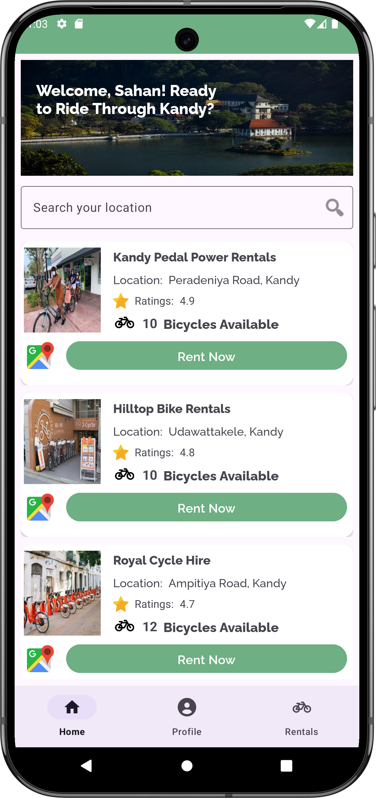
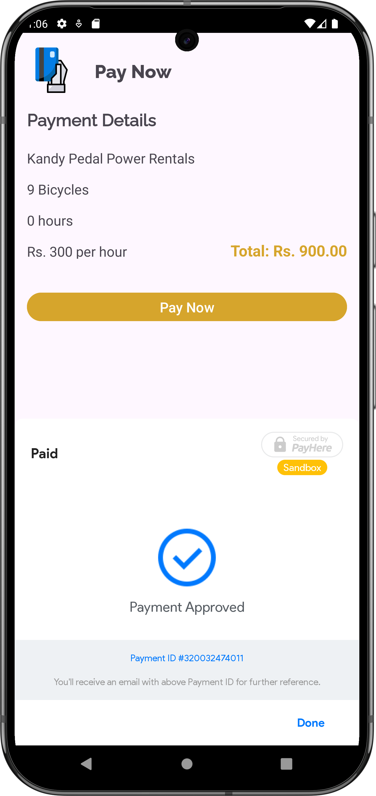
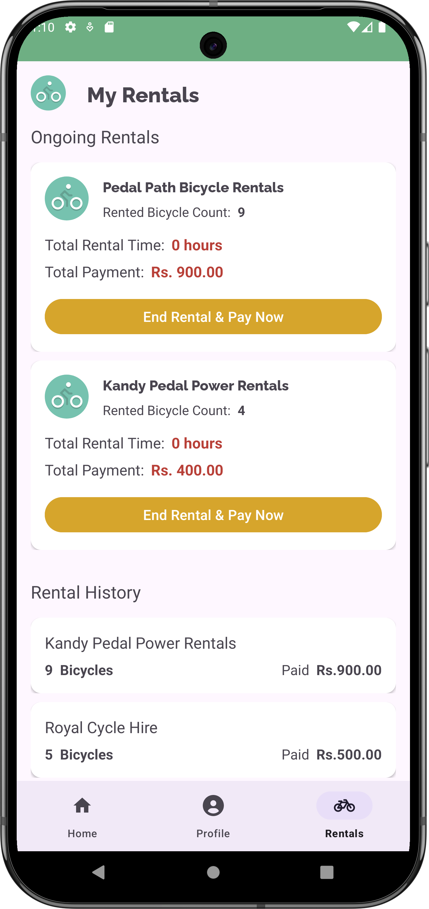

# 🚲 Bicycle Renting Application

## 📌 Overview
This is a **Bicycle Renting Application** built with **Android Studio using pure Java** and **SQLite** as the database. The application allows users to search for bicycle renting places using **Google Maps** and a **search feature**. Users can view renting details, rent bicycles, and make payments through **PayHere Payment Gateway**.

## 🎯 Features
- 🗺 **Google Maps Integration** – Users can search for renting locations on a map.
- 🔍 **Search Functionality** – Search by location or renting place name.
- 📋 **View Renting Details** – Check availability, pricing, and rental terms.
- 💳 **PayHere Payment Gateway** – Secure online payments for bicycle rentals.
- ⏳ **Automatic Rent Time Calculation** – Calculates renting time from booking to payment.
- 📊 **SQLite Database** – Local data storage for rental records.

## 🛠 Tech Stack
- **Android Studio** (Java)
- **SQLite** (Database)
- **Google Maps API** (Location & Search)
- **PayHere Payment Gateway** (Payment Processing)

## 🚀 Installation & Setup
```sh
# Clone the repository
git clone https://github.com/nethmidinanjana/cycler.git

# Open in Android Studio

# Set up Google Maps API Key
# - Go to Google Cloud Console (https://console.cloud.google.com/)
# - Enable Maps SDK for Android
# - Generate an API Key and add it to AndroidManifest.xml

# Run the application on an emulator or physical device.
```

## ⚡ Usage Guide
1. **Search for renting places** by typing the location or selecting on the map.
2. **View available bicycles** and rental details.
3. **Select a bicycle** and confirm the rental.
4. **Make payment** through PayHere to finalize the rental.
5. **Track renting time** from booking to payment.

## 🛡 Security & Data Handling
- All **transactions are handled securely** via PayHere.
- **User data is stored locally** using SQLite.

## 📸 Screenshots





